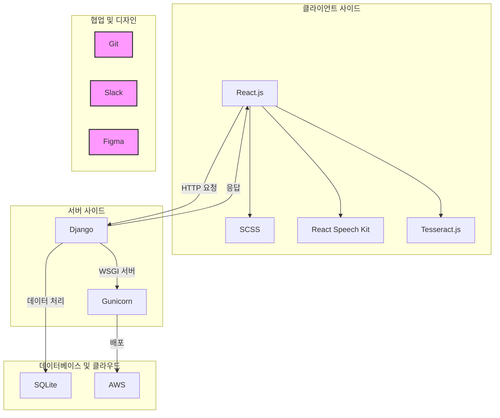

# 프로젝트 설명
`토킹핸드`는 글을 읽지 못하는 청각 장애인을 위한 수어 번역기를 개발하여 접근성을 높이고 교육 환경을 개선하는 것을 목표로 합니다. 음성 인식과 OCR 기능을 추가하여 더욱 향상된 사용자 경험을 제공합니다. 교내 SW공모전에서 학장상을 수상하였으며, 접근성에 대한 지속적인 연구와 개발을 통해 장애인 복지를 개선하고자 합니다.

# 사용 기술 및 라이브러리
Web: ReactJS, react-speech-kit, Tesseract.js, SCSS  
Server: Django, Gunicorn, SQLite 
Cloud: AWS 
공통: Git, Slack, Figma

# 아키텍처

