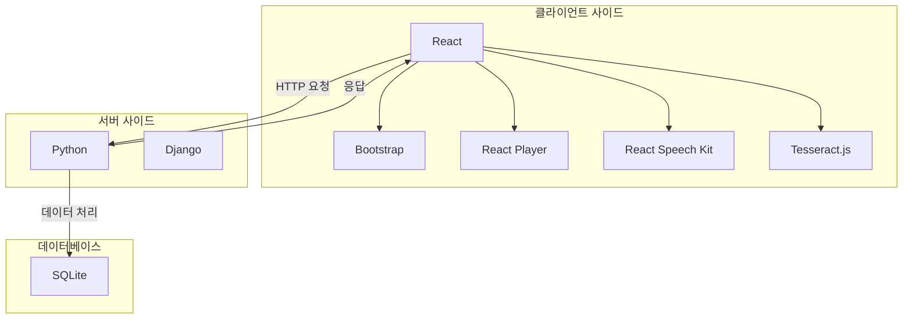

```mermaid
graph TD
    
    subgraph "클라이언트 사이드"
        A1[React]
        A2[Bootstrap]
        A3[React Player]
        A4[React Speech Kit]
        A5[Tesseract.js]
    end
    
    subgraph "서버 사이드"
        B1[Python]
        B2[Django]
    end
    
    subgraph "데이터베이스"
        C1[SQLite]
    end
    
    A1 --> A2
    A1 --> A3
    A1 --> A4
    A1 --> A5
    A1 -->|HTTP 요청| B1
    B1 -->|데이터 처리| C1
    B1 -->|응답| A1
```
